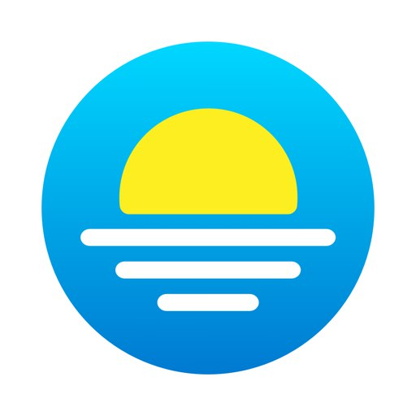
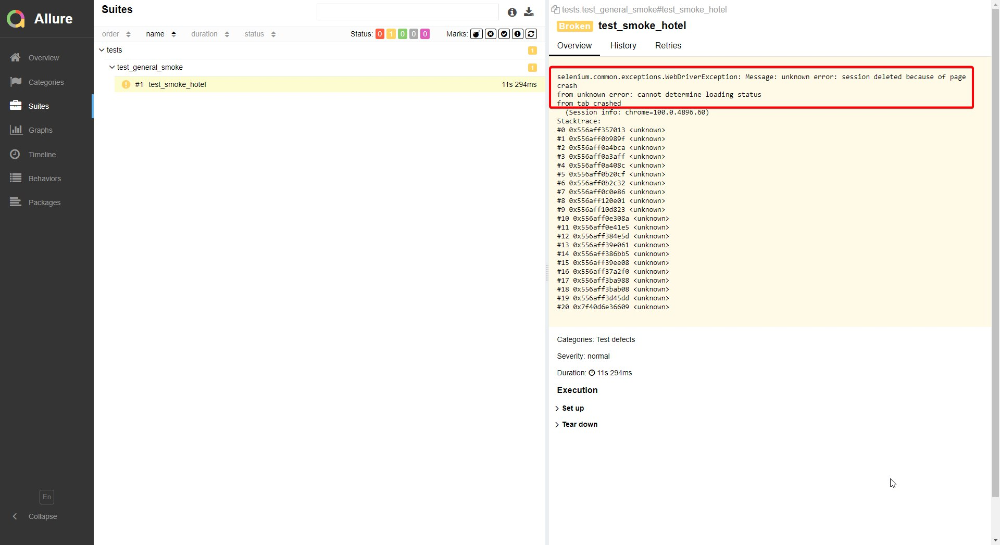
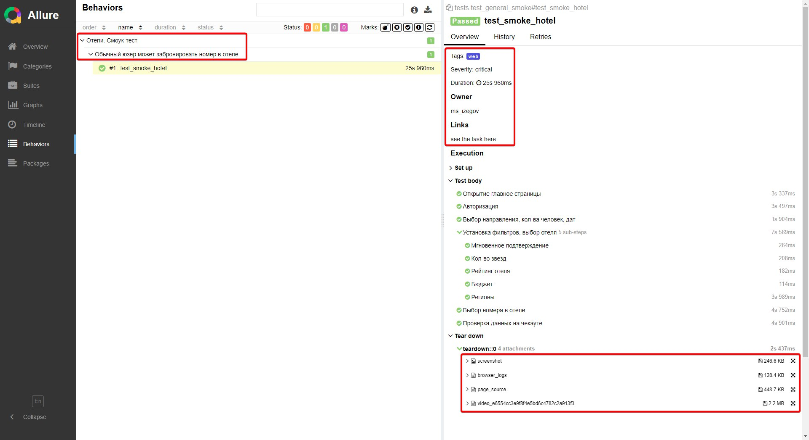
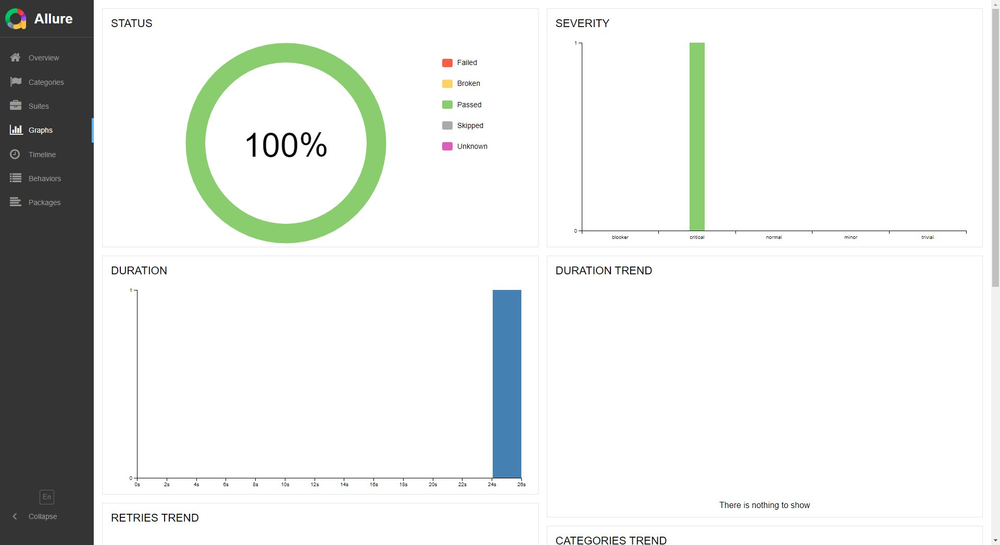
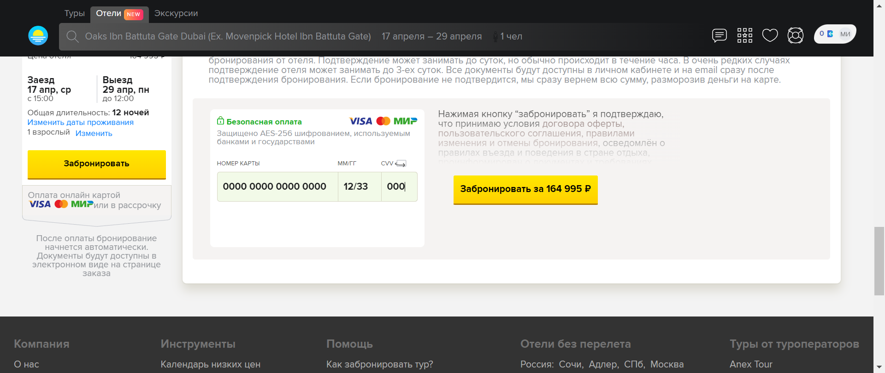

##  Проект автотестов для WEB UI сайта level.travel

<!-- Технологии -->

## :gear: Используемые технологии
<p  align="center">
  <code></code>
  <code></code>
  <code></code>
  <code></code>
  <code></code>
  <code></code>
  <code></code>
  <code></code>
  <code></code>
  <code></code>
  <code></code>
</p>

## :open_book: Описание
В проекте представлен один **высокоуровневый** смоук-тест всего бизнес-пути, написанный на Python + Selene (обёртка Selenium).  
  
По факту этот высокоуровневый тест может быть разбит на **множество низкоуровневых**, ведь частью общего "смоука" являются отдельные смысловые блоки такие как:  
- [x] Авторизация пользователя
- [x] Работа с календарём и выбором дат
- [x] Работа фильтров
- [x] Отдельные тесты каждой из страниц (главная, страницы с карточками отелей, страница отелей, чекаут-страница)
  
UI-тест на сайте `level.travel`  
  
Точка `A`: главная страница сайта 
  
Точка `B`: бронирование отеля (ввод карты, активация кнопки "забронировать")  
  
Подключена система отчетности Allure Reports с вложениями (логи, скриншоты, видео и пр.)   
  
Шаги теста отображены в виде "аллюровских" степов через `with allure.step`    
  
Предполагалось, что Браузер в UI-тестах запускается удаленно в Selenoid (подключение к Jenkins), однако ресурсов учебного Selenoid не хватило для этого теста (см. раздел Jenkins).  

<!-- Jenkins -->

##  Запуск тестов из Jenkins

Как упоминалось в описании проекта, ресурсов учебного Selenoid оказалось мало для запуска довольно объёмного теста, о чем свидетельствует ошибка из `allure-отчета`:

<p></p>

В связи с этим предлагаю ознакомится с подключением к `Jenkins` и работой в связке с `Selenoid` (где удаленно запускаются тесты), `Allure` и `Telegram-notifications` в другом моём проекте: [API-tests project](https://github.com/MikhailIzegov/API_autotest)


<!-- Отчеты -->

## :bar_chart: Отчеты о прохождении тестов доступны в Allure

> При локальном запуске введите в командной строке: 
```bash
allure serve 
```

###  Allure

#### Примеры отображения тестов



#### Во вкладке Graphs можно посмотреть графики о прохождении тестов, по их приоритезации, по времени прохождения и др.


  
#### В конце каждого запуска браузер, прежде чем закрыться, сохраняет итоговый скриншот, который доступен в Allure вместе с другой информацией (логи, html и пр.):


